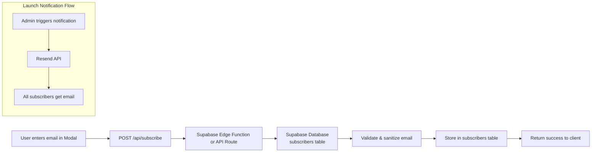

# Email Collection and Notification System Plan

## 1. Recommended Approach and Why

### Recommendation: **Supabase + Resend**

This combination provides the best balance for a small landing page:

| Criteria | Supabase + Resend | Why |
|----------|-------------------|-----|
| **Ease of Setup** | High | Both have excellent Next.js documentation, work with API routes |
| **Free Tier** | Excellent | Supabase: 500MB DB (够存 100k+ emails), Resend: 3,000 emails/month |
| **Minimal Infrastructure** | Yes | Serverless API routes only, no separate hosting needed |
| **Scalability** | High | Can grow to millions of subscribers without architecture changes |
| **Cost at Scale** | Predictable | Supabase: $25/month pro plan, Resend: ~$20/month for 50k emails |

### Why Not Others:

- **Loops/ConvertKit**: Marketing platforms, overkill for simple "notify when launched"
- **N8N**: Workflow automation, requires managing separate infrastructure
- **SendGrid/Mailgun**: Good for sending but no built-in subscriber management
- **Resend alone**: Can't store subscribers, would need external DB anyway

---

## 2. Architecture Overview



### Components:

1. **Frontend**: Modified `ComingSoonModal.tsx` with email submission state
2. **API Route**: `app/api/subscribe/route.ts` - handles email collection
3. **Database**: Supabase `subscribers` table with email, timestamp, status
4. **Notification**: Resend API for sending launch notifications

---

## 3. Step-by-Step Implementation Tasks

### Phase 1: Database Setup (Supabase)

- [ ] **T1.1**: Create Supabase project at [supabase.com](https://supabase.com)
- [ ] **T1.2**: Create `subscribers` table with schema:
  ```sql
  CREATE TABLE subscribers (
    id UUID DEFAULT gen_random_uuid() PRIMARY KEY,
    email TEXT NOT NULL UNIQUE,
    created_at TIMESTAMP WITH TIME ZONE DEFAULT NOW(),
    status TEXT DEFAULT 'pending' CHECK (status IN ('pending', 'confirmed', 'unsubscribed')),
    confirmation_token TEXT
  );
  ```
- [ ] **T1.3**: Enable Row Level Security (RLS) - allow inserts from authenticated API only
- [ ] **T1.4**: Create an API key in Supabase dashboard

### Phase 2: Email Service Setup (Resend)

- [ ] **T2.1**: Create Resend account at [resend.com](https://resend.com)
- [ ] **T2.2**: Add and verify a domain (or use `.onepipe.io` test domain initially)
- [ ] **T2.3**: Create an API key in Resend dashboard
- [ ] **T2.4**: (Optional) Set up React Email template for launch notification

### Phase 3: API Implementation

- [ ] **T3.1**: Install Supabase JS client: `npm install @supabase/supabase-js`
- [ ] **T3.2**: Install Resend: `npm install resend`
- [ ] **T3.3**: Create `app/api/subscribe/route.ts` - POST endpoint to collect emails
- [ ] **T3.4**: Create `app/api/subscribers/route.ts` - GET endpoint for admin (optional)
- [ ] **T3.5**: Add rate limiting to prevent abuse

### Phase 4: Frontend Integration

- [ ] **T4.1**: Modify `ComingSoonModal.tsx` to add:
  - Email validation
  - Loading state on submit
  - Success/error feedback
  - Form submission to API
- [ ] **T4.2**: Add environment variables for API keys

### Phase 5: Notification System (Launch)

- [ ] **T5.1**: Create admin endpoint or script to fetch subscribers
- [ ] **T5.2**: Create email template with React Email
- [ ] **T5.3**: Batch send using Resend (handle 3k limit on free tier)

---

## 4. Files to Create or Modify

### New Files:

| File Path | Purpose |
|-----------|---------|
| `app/api/subscribe/route.ts` | POST endpoint to collect and store emails |
| `lib/supabase.ts` | Supabase client configuration |
| `lib/resend.ts` | Resend client configuration |
| `emails/LaunchNotification.tsx` | React Email template for launch email |
| `types/email.ts` | TypeScript types for subscribers |

### Modified Files:

| File | Changes |
|------|---------|
| `components/ui/ComingSoonModal.tsx` | Add form state, validation, API call, success/error UI |
| `.env.local` | Add Supabase and Resend API keys |
| `package.json` | Add `@supabase/supabase-js` and `resend` dependencies |

---

## 5. Environment Variables Needed

```env
# Supabase
NEXT_PUBLIC_SUPABASE_URL=https://your-project.supabase.co
SUPABASE_SERVICE_ROLE_KEY=your-service-role-key

# Resend
RESEND_API_KEY=re_your_api_key

# Optional
NEXT_PUBLIC_SITE_URL=https://yourdomain.com
```

### Security Note:
- `SUPABASE_SERVICE_ROLE_KEY` must be kept secret (server-side only)
- `RESEND_API_KEY` must be kept secret (server-side only)
- `NEXT_PUBLIC_SUPABASE_URL` can be public (but project URL is not sensitive)

---

## 6. Detailed API Design

### POST /api/subscribe

**Request:**
```typescript
// POST body
{
  email: string
}
```

**Response (Success - 200):**
```json
{
  "success": true,
  "message": "Successfully subscribed"
}
```

**Response (Already exists - 409):**
```json
{
  "success": false,
  "message": "Email already registered"
}
```

**Response (Validation error - 400):**
```json
{
  "success": false,
  "message": "Invalid email address"
}
```

---

## 7. Pros/Cons vs Alternatives

### Supabase + Resend vs Alternatives

| Approach | Pros | Cons |
|----------|------|------|
| **Supabase + Resend** | Full control, generous free tiers, scales well, no vendor lock-in | Requires managing two services |
| Resend alone | Simpler, great API | No subscriber database, can't export/manage list |
| Loops/ConvertKit | All-in-one, marketing features | Overkill for simple notify-me, less control |
| N8N + Email | Highly automatable | Separate hosting, complex setup |
| Supabase + SendGrid | Enterprise-grade sending | SendGrid free tier very limited (100/day) |
| Mailgun | Good deliverability | Complex setup, expensive at scale |

---

## 8. Estimated Costs (Starting)

| Service | Free Tier | Cost at 10k subscribers |
|---------|-----------|--------------------------|
| Supabase | 500MB DB, 1GB storage | ~$25/month (pro plan) |
| Resend | 3,000 emails/month | ~$20/month (50k limit) |
| **Total** | | **~$45/month** |

---

## 9. Implementation Priority

For immediate launch with minimal setup:

1. **Day 1**: Supabase setup + API route + email collection
2. **Day 2**: Frontend integration (modal)
3. **Launch**: Add Resend for actual email sending when you launch

---

## 10. Sample Code Snippets

### Supabase Client (`lib/supabase.ts`):
```typescript
import { createClient } from '@supabase/supabase-js'

const supabaseUrl = process.env.NEXT_PUBLIC_SUPABASE_URL!
const supabaseServiceKey = process.env.SUPABASE_SERVICE_ROLE_KEY!

export const supabase = createClient(supabaseUrl, supabaseServiceKey)
```

### Subscribe API Route (`app/api/subscribe/route.ts`):
```typescript
import { NextResponse } from 'next/server'
import { supabase } from '@/lib/supabase'

export async function POST(request: Request) {
  try {
    const { email } = await request.json()

    // Validate email
    if (!email || !/^[^\s@]+@[^\s@]+\.[^\s@]+$/.test(email)) {
      return NextResponse.json(
        { success: false, message: 'Invalid email address' },
        { status: 400 }
      )
    }

    // Insert into Supabase
    const { error } = await supabase
      .from('subscribers')
      .insert([{ email, status: 'confirmed' }])

    if (error?.code === '23505') {
      return NextResponse.json(
        { success: false, message: 'Email already registered' },
        { status: 409 }
      )
    }

    if (error) {
      throw error
    }

    return NextResponse.json(
      { success: true, message: 'Successfully subscribed' },
      { status: 200 }
    )
  } catch (err) {
    console.error('Subscribe error:', err)
    return NextResponse.json(
      { success: false, message: 'Internal server error' },
      { status: 500 }
    )
  }
}
```

---

## Summary

**Recommended Stack**: Supabase (database) + Resend (email delivery)

**Key Benefits**:
- Generous free tiers (Supabase DB + Resend 3k/month)
- Serverless architecture - no separate servers
- Full control over data
- Easy to scale
- Clean Next.js App Router integration

**Minimum Viable Implementation**:
1. Supabase project + `subscribers` table
2. API route at `/api/subscribe`
3. Updated modal with form submission
4. Resend for launch notification (add when ready to launch)
